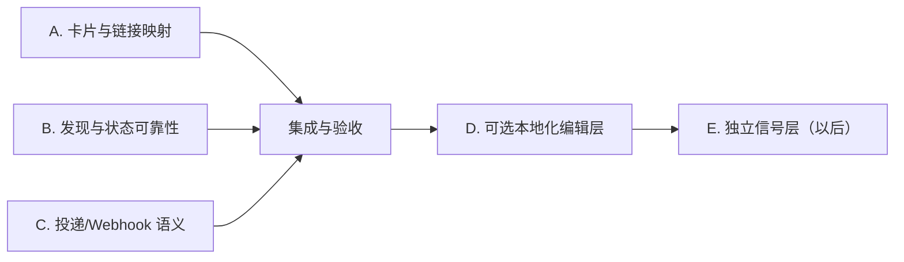

# Perovskite Scout 施工计划（v0.2）

**目标：** 先把每期推送变成「看得懂、点得进、不会漏」，再考虑中文编辑与社交信号层。

**本期不做：** 接入 X/LinkedIn/公众号、改变 tier/relevance 的判定权、让 LLM 成为定时管线的必需依赖、二维码或图片内长链接。

## 总体原则

1. `feed-papers.json` 与 `feed-industry.json` 是事实与规则判定的 canonical 数据；展示层不得改写它们。
2. 图片负责快速阅读；紧随图片的短文本负责可点击原文链接。二者用稳定编号一一对应。
3. LLM（未来可选）只能把已有标题/摘要本地化或压缩表达；不得影响入选、相关性、tier、排序，且失败时必须回退到英文原题。
4. 一次 run 只有一个 writer。抓取失败、校验失败和 webhook 失败均不能伪装为「本周无新内容」或「已投递」。
5. 每个工作包都要包含离线回归测试；不要以实时网络返回作为唯一验证。

## 依赖与并行图

**可并行：** A、B、C 的文件边界已隔离，可由三个对话同时处理。

**不能并行合并：** A/B/C 结束后，由一个集成对话统一处理跨模块测试、README/skill 文档和最终样例卡片。D、E 依赖前面完成，不在本期启动。

## A. 卡片与可点击链接映射

**优先级：** P0（用户可感知的首要改进）

**负责范围：** `scripts/text_renderer.py`、`scripts/image_renderer.py`、新增 `tests/test_presentation.py`。
**禁止修改：** `deliver.py`、发现逻辑、tier/relevance 逻辑、state 文件格式。

### 要做什么

1. 为当期所有可投递条目生成稳定的 `delivery_index`（论文 01–05，产业 06–07；若项目有删减则连续编号）。同一期 card 与 compact 文本必须使用完全相同的编号与排序。
2. 图片不再显示：原始 URL、`score` 数值、`openalex_id`/OpenAlex 截断文本、原始摘要段落。
3. 图片每条只显示：`编号`、`T1–T4`、来源名（例如 `arXiv`/`pv magazine`）、日期、展示标题和至多 2 个确定性主题标签。
4. 首版展示标题只使用英文原题的卫生截断；不要在此工作包引入 LLM 或中文改写。主题标签必须来自透明关键词映射，未命中时不显示。
5. 卡片限定为研究 Top 3–4 条与产业 Top 1 条；compact 文本仍保留全量（当前上限为论文 Top5、产业 Top2）的编号、原题与可点击 URL。
6. 卡片底部增加简短的明确提示：`完整原题与可点击链接见下一条消息 01–07`。
7. 把当前容易误解为结论已验证的 `source verified` 文案改为中性来源说明，或移除。

### 验收标准

- 相同输入连续渲染两次，编号与排序完全相同。
- 图片中不出现 `http://`、`https://`、`score`、`openalex` 或原始摘要文本。
- compact 文本每个卡片条目都有相同编号、原题和可点击 URL；不存在孤儿编号或重复编号。
- 空论文/空产业 feed 仍能生成结构正确的文本和卡片。
- 现有回归测试继续通过，新增测试不访问网络。

### 可直接分配的任务简报

> 实现施工计划 A：只修改 `scripts/text_renderer.py`、`scripts/image_renderer.py` 和新增 `tests/test_presentation.py`。将图片改为编号化的阅读卡片，compact 文本改为同编号的可点击链接索引。不要改 `deliver.py`、任何发现/state/tier/relevance 逻辑；不要引入 LLM、二维码或网络依赖。按 `docs/implementation-plan.md` 的 A 节验收并报告测试命令与结果。

## B. 发现、状态与源健康可靠性

**优先级：** P0（可信度底线）

**负责范围：** `scripts/discover_papers.py`、`scripts/discover_industry.py`、`scripts/run_pipeline.py`、`config/sources*.json`、新增 `tests/test_discovery_reliability.py`。
**禁止修改：** renderer、`deliver.py`、webhook 协议。

### 要做什么

1. 将 arXiv 的固定 `max_results: 30` 改为有 watermark 的分页扫描：从最新页向后读取，直到本次扫描已覆盖上一次**成功**扫描的时间边界；在结果密集的周内也不能永久漏掉较老的新条目。
2. state 中显式记录每个源的成功 watermark/scan 元数据；仅当全量扫描成功后才推进该 watermark。保留现有 ID 去重，避免重叠窗口导致重复。
3. 将 arXiv endpoint 改为 HTTPS，并为页大小、最大页数、重叠窗口或等价参数写出明确配置与异常信息。
4. 对行业源区分 `no_new_content` 与 `fetch_error`/`parse_error`。失败源必须进入结构化 health 结果；当达到配置的关键源失败阈值时，发现步骤返回非零，而不是静默产出部分周报。
5. `run_pipeline.py` 改为 fail-fast：发现或 enrich 失败后不得继续基于旧 feed 渲染新的 digest/card。
6. 对 state/feed 写入采用原子替换；不要在半写入状态留下损坏 JSON。

### 验收标准

- 模拟某周期超过一页的新 arXiv 条目时，全部只进入一次 feed。
- 中途中断/抓取失败时 watermark 不前移，下一次成功运行仍能发现未投递条目。
- 关键 RSS 源失败使 pipeline 非零退出并阻止渲染；真正没有新内容仍可合法得到空 feed。
- 不允许 `run_pipeline.py` 在上游失败后执行 renderer。
- 所有测试可用 mock HTTP 响应运行。

### 可直接分配的任务简报

> 实现施工计划 B：只修改发现、状态和管线编排文件（`discover_papers.py`、`discover_industry.py`、`run_pipeline.py`、相关 config）并新增 `tests/test_discovery_reliability.py`。实现 watermark 分页、行业源健康门禁、原子写与 fail-fast。不要修改 renderer、`deliver.py` 或 webhook。按 `docs/implementation-plan.md` 的 B 节验收，尤其覆盖“多页不漏报”和“失败不推进 watermark”。

## C. 单实例投递与 webhook 语义

**优先级：** P1

**负责范围：** `scripts/deliver.py`、`perovskite-scout-skill/references/webhook-contract.md`、新增 `tests/test_delivery_transport.py`。
**禁止修改：** renderer、发现/过滤/tier 逻辑、已有测试文件。

### 要做什么

1. 为 `deliver.py` 增加跨平台单实例锁（含 PID/开始时间/过期恢复策略），确保重叠定时任务不能同时修改 state、feed 和 delivery 目录。
2. 在 manifest 和 webhook payload 中生成稳定的 `delivery_id`；将其作为 webhook 幂等键/header 或等价字段。
3. 明确 `--transport webhook` 的失败语义：默认 webhook 失败必须是非零退出、manifest=`failed`，且恢复 dedup state；如保留 local fallback，必须通过显式参数启用，并写入 `status`/`reason` 让调度器不会误报已送达。
4. webhook payload 不应把本机相对路径误表述为远端可用资源。保留当前路径字段时，应在契约中声明共享挂载前提；本期不实现图片上传。
5. 维持当前 payload 组包的原子 `preparing → ready` 行为；锁释放、异常 cleanup 和 state 回滚必须覆盖所有退出路径。

### 验收标准

- 已持有锁的第二个 `deliver` 立即以明确错误退出，且不改写状态。
- webhook 5xx、超时、缺少 URL 均不会返回成功，也不会吃掉待投递内容。
- 成功 webhook 载荷含唯一 `delivery_id`；重复同一投递可由接收端去重。
- 现有 local 模式保持向后兼容。

### 可直接分配的任务简报

> 实现施工计划 C：只修改 `scripts/deliver.py`、`perovskite-scout-skill/references/webhook-contract.md`，并新增 `tests/test_delivery_transport.py`。增加单实例锁、delivery_id 与严格 webhook 失败语义；不要修改 renderer 或发现逻辑，不要编辑现有测试文件。按 `docs/implementation-plan.md` 的 C 节验收，并特别验证失败后 dedup state 被恢复。

## 集成与验收（必须串行）

**负责范围：** 合并 A/B/C 后的冲突解决、`README-perovskite-scout.md`、`perovskite-scout-skill/SKILL.md`、`perovskite-scout-skill/references/openclaw-manual.md`、跨模块测试与示例卡片。

1. 先合并 B，再合并 A，最后合并 C；最后由集成者处理 `deliver.py` 与新渲染产物的契约。
2. 更新 README、skill instructions 与 OpenClaw 手册：明确先图后 compact 文本、图片无链接、webhook 失败语义和并发运行限制。
3. 执行所有单元测试；用固定 fixture 跑一次 preview，人工审阅输出卡片：标题层级、编号、可读性、无 URL、无技术内部字段。
4. 验证至少四个端到端分支：正常有新内容、安静周、关键源失败、webhook 失败。
5. 不要在这个阶段加入社交源、中文 LLM 改写或二维码；这些另立变更集。

## D. 可选本地化编辑层（A/B/C 稳定后）

**目的：** 让中文用户更快理解标题，同时保证无中文字体、编码受限或模型不可用的云端环境仍能稳定投递。

### 决策

- canonical 字段永远是原始英文 `title`、`abstract`、`url`。
- 增加展示策略 `en | zh | auto`。`auto` 仅在 CJK 字体/输出能力确认可用时启用中文；否则使用英文。
- LLM 输出为可选缓存字段，如 `display_title_zh` 和 `focus_zh`；它不修改 canonical feed，也不是定时任务成功的前置条件。
- LLM 提示必须禁止添加数值、效率、寿命、因果、首次/突破/关键等结论性表述；失败、超时或校验不通过时回退英文原题。

## E. 独立人物/企业信号层（以后）

只有在证据层与投递闭环稳定后再启动。新建 `feed-signals.json`，仅收白名单研究团队、企业/技术负责人等公开更新。它必须标为「线索/信号」，不能改变论文 tier/relevance，不能与论文或行业事实混排，也不能作为科研结论。

## 完成定义

v0.2 在以下条件同时满足时完成：

- 图和可点击文字能通过编号无歧义地配对；图片不含无法点击的 URL。
- 数据源高频更新不因固定 Top N 而永久漏报。
- 关键数据源失败、管线失败、并发运行和 webhook 失败都不会造成静默漏发、误报成功或 state 提前推进。
- 默认运行不依赖 LLM、中文字符支持或 CJK 字体。
